# Step 4 — preuves visuelles locales

Données synthétiques uniquement ; aucune URL privée. Captures desktop 1440 px,
mobile 390 px et FR/sombre 320 px. Le détail et les formulaires défilent dans
la fiche existante ; aucun débordement horizontal observé.

## Connexion — desktop clair

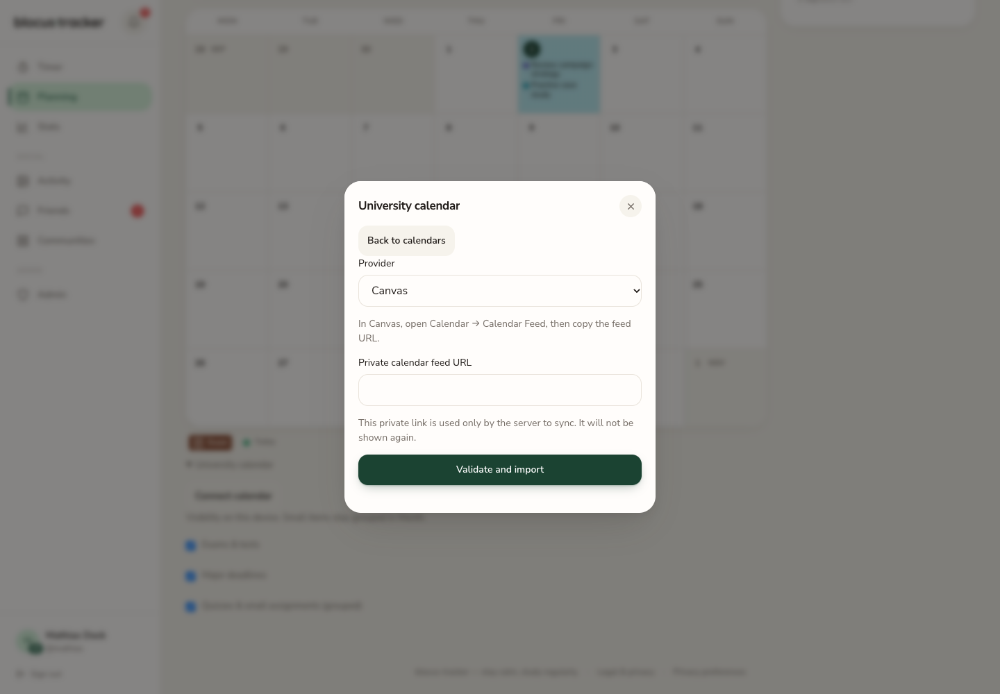

## Connexion — mobile clair

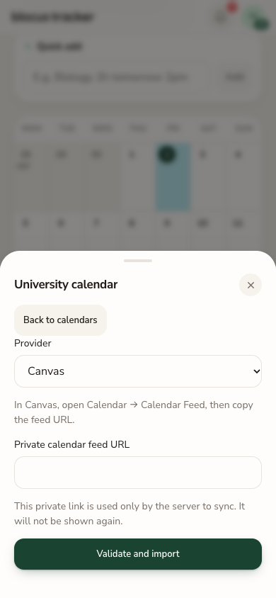

## URL invalide — mobile

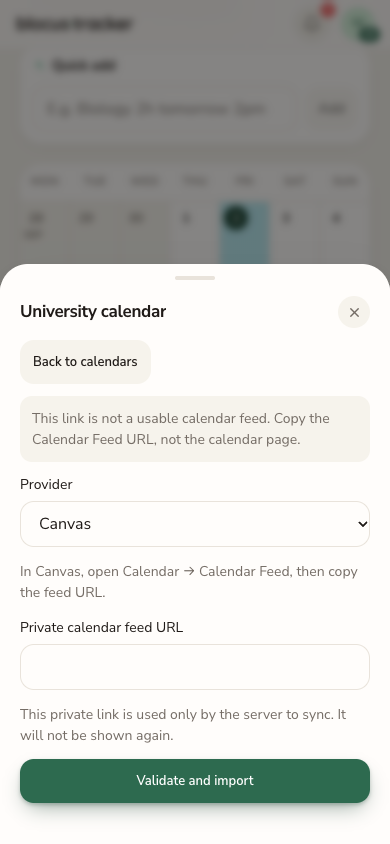

## Association explicite — un cours mappé, un non associé

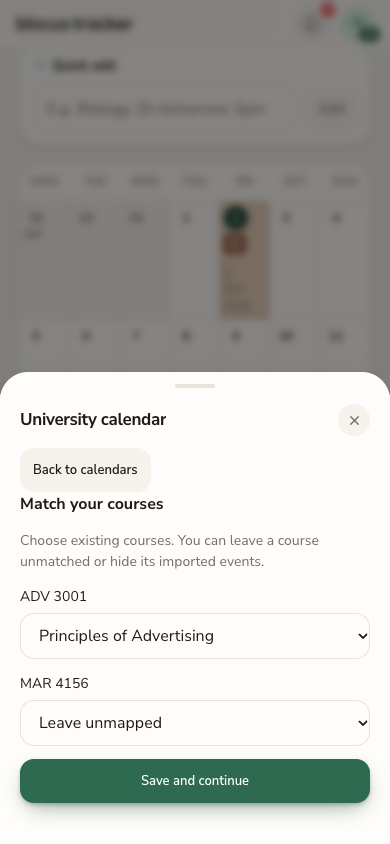

## Résumé compact — examen probable et examen possible

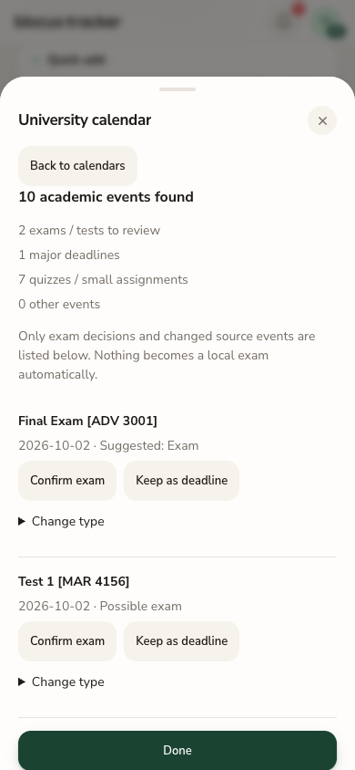

## Formulaire de création explicite — mobile

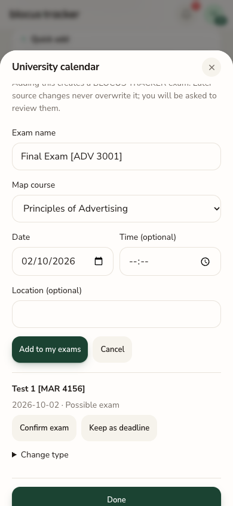

## Formulaire de création explicite — desktop

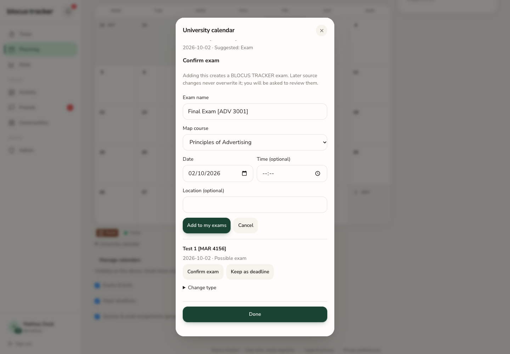

## Mois dense — desktop

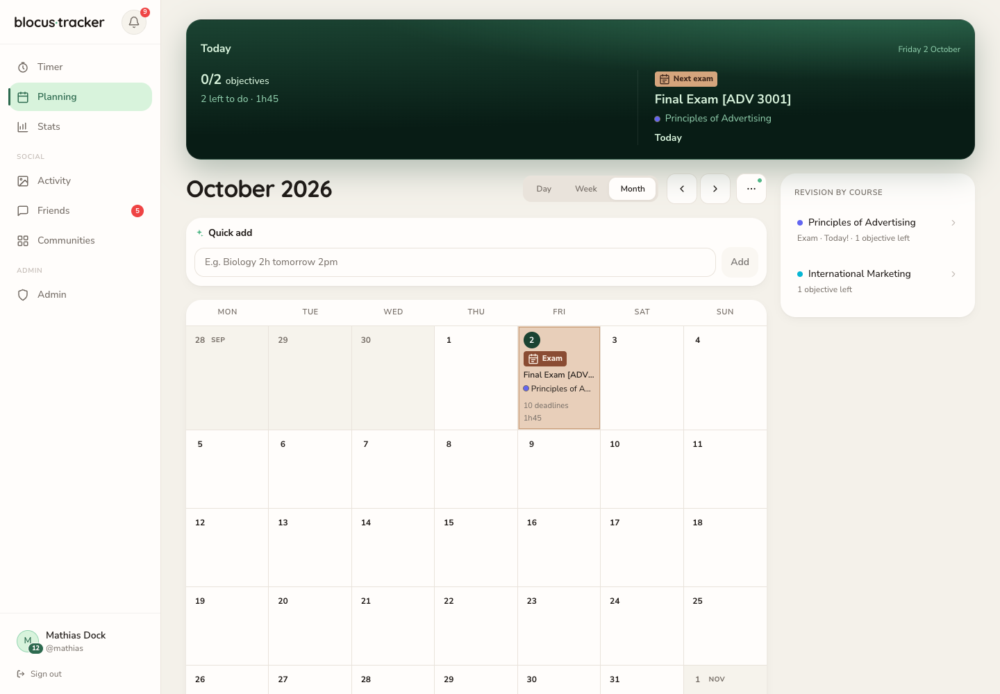

## Mois dense — mobile

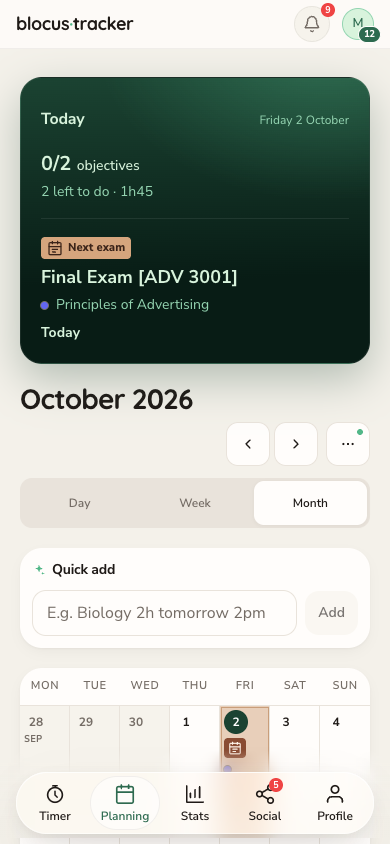

## Détail jour — étude puis échéances (cours non associé inclus)

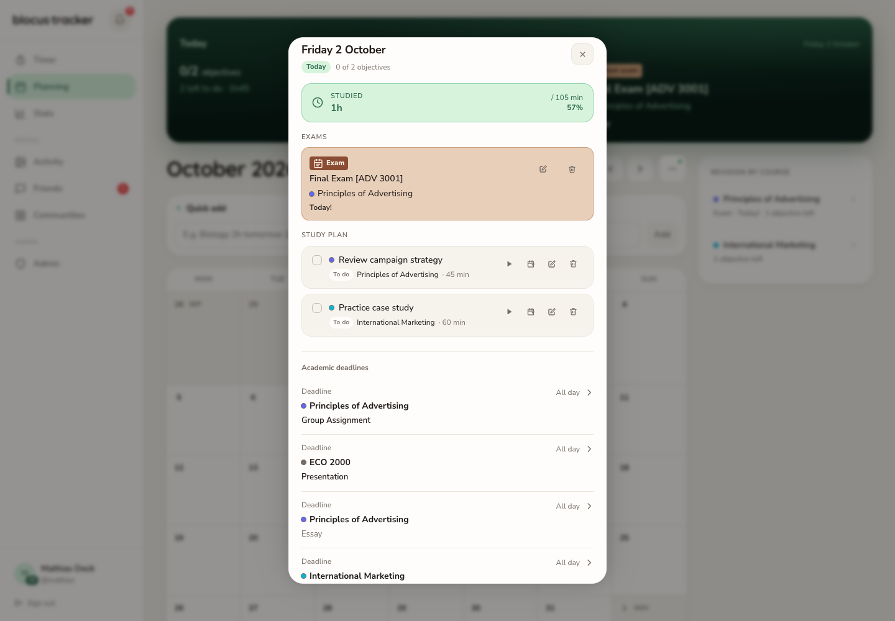

## Nouveau cours détecté sans bloquer la synchronisation

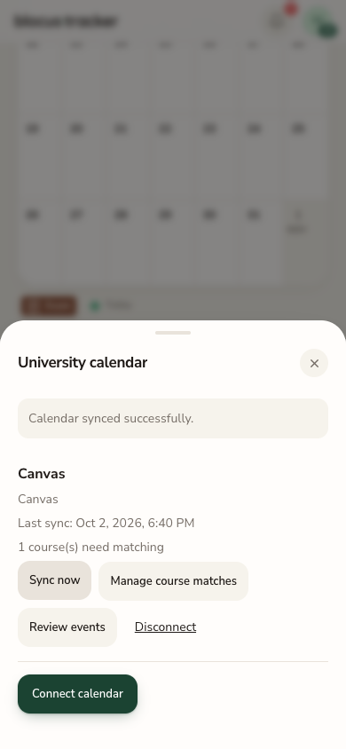

## Date source modifiée — examen local conservé

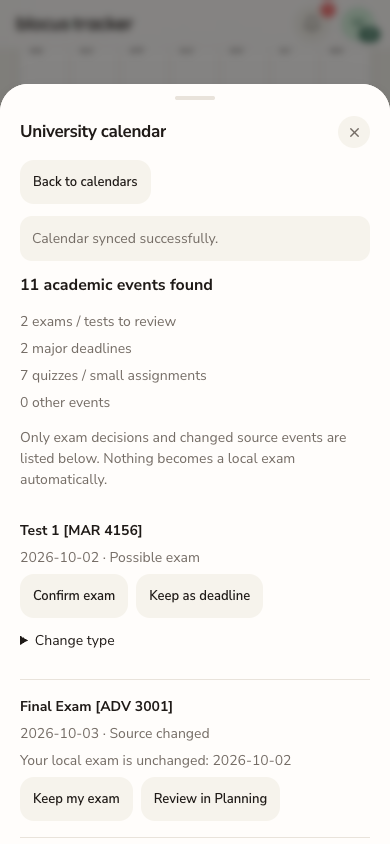

## Gestion — desktop sombre FR

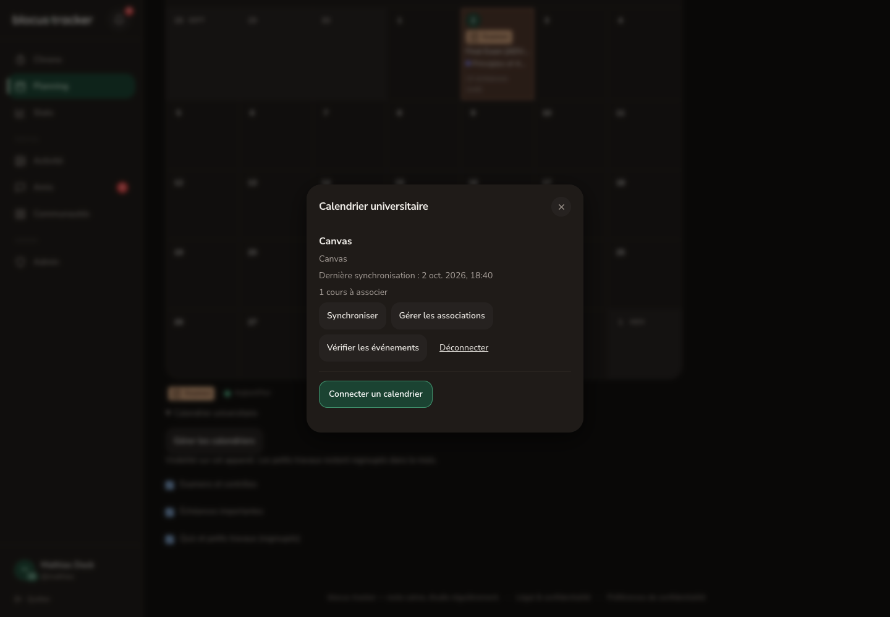

## Gestion — 320 px sombre FR

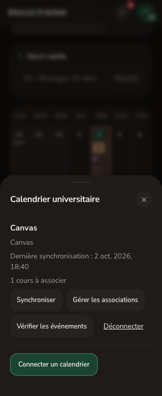

## Confirmation de déconnexion — 320 px sombre FR

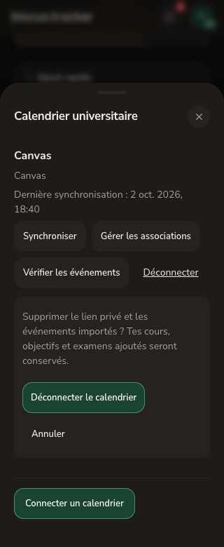

Tests navigateur : import de 10 événements, une conversion explicite, sync identique sans doublon, nouveau cours (11 événements), date source modifiée sans déplacer l’examen local, acquittement, correspondance modifiée, cours ignoré, puis déconnexion. Après déconnexion : 1 examen, 2 cours et 2 objectifs préservés, 0 donnée externe.

Le vrai flux Canvas et le parcours hébergé ne sont pas validés par ces fixtures.
